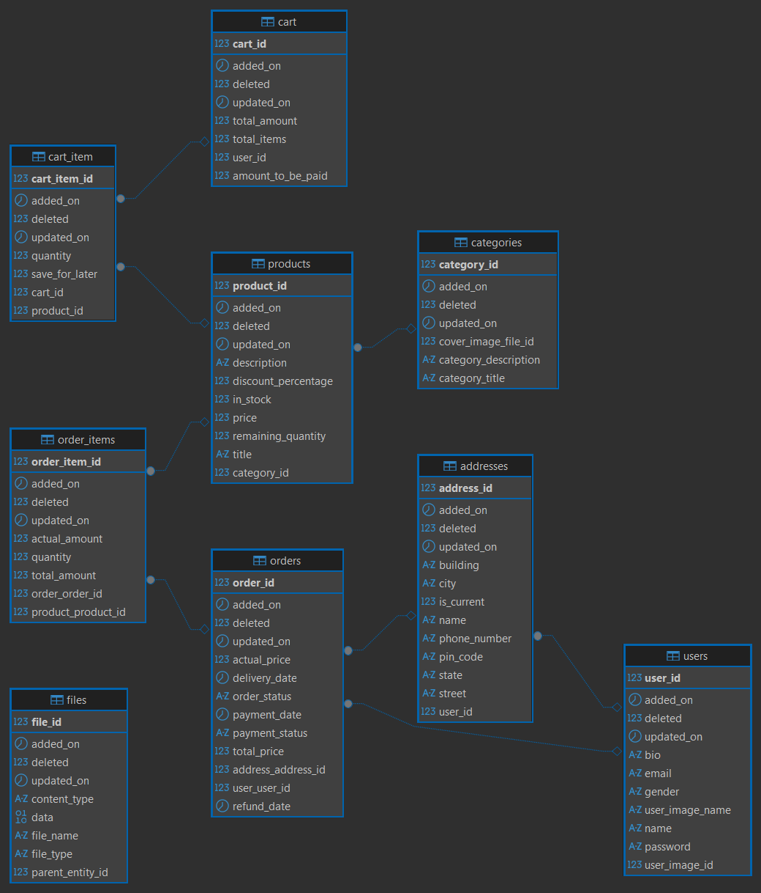

<div align="center">

# 🛒 NexCart

**A production-inspired e-commerce backend built with Java & Spring Boot**

[](https://openjdk.org/)
[](https://spring.io/projects/spring-boot)
[](https://spring.io/projects/spring-data-jpa)
[](https://www.mysql.com/)
[](https://maven.apache.org/)
[](#license)

</div>

---

## 📖 Project Overview

**NexCart** is a backend e-commerce application designed to demonstrate scalable backend engineering practices using **Java** and **Spring Boot**. It models real-world online store workflows — products, categories, shopping carts, orders, and inventory — behind a clean, RESTful API.

The project emphasizes:

- Clean, **feature-based** package structure
- **Layered architecture** (Controller → Service → Repository)
- **DTO-driven** API contracts
- Centralized **exception handling** and **structured logging**
- Solid **relational data modeling** with Spring Data JPA & Hibernate

> This is a backend-only project (no frontend/UI). It is intended as a portfolio-grade demonstration of backend API design and Spring Boot best practices.

---

## ✨ Features

- 🛍️ **Product Management** — create, update, delete, fetch, and browse products
- 🗂️ **Category Management** — organize products into categories
- 🛒 **Shopping Cart** — per-user cart with cart-item level operations
- 📦 **Order Management** — place orders, track and update order/payment status
- 📊 **Inventory Management** — stock quantity and in-stock status tracked per product
- 🖼️ **Product Image Upload** — attach and retrieve images for products
- 🖼️ **Category Image Upload** — cover images for categories
- 🖼️ **User Image Upload** — profile images for users
- 🌐 **RESTful APIs** — resource-oriented endpoints with consistent response envelopes
- 📄 **Pagination** — offset-based (and cursor/scroll-based, where implemented) pagination
- ↕️ **Sorting** — sortable listings (e.g. products, users)
- 🔎 **Dynamic Filtering** — e.g. filtering orders by period
- 🔍 **Keyword Search** — search across products, categories, and users
- 🚨 **Global Exception Handling** — centralized, consistent error responses
- ✅ **Request Validation** — Bean Validation (`jakarta.validation`) on incoming DTOs
- 📝 **Structured Logging** — via SLF4J / Logback
- 📦 **DTO-based API Design** — entities never leak past the service layer
- 🧩 **Feature-based Package Structure** — code organized by business capability
- 🏗️ **Layered Architecture** — Controller → Service → Repository separation
- 🗄️ **Optimized Relational Design** — via Spring Data JPA & Hibernate

---

## 🧰 Tech Stack

| Category | Technology |
|---|---|
| Language | Java |
| Framework | Spring Boot |
| Persistence | Spring Data JPA, Hibernate |
| Database | MySQL |
| Build Tool | Maven |
| Boilerplate Reduction | Lombok |
| Logging | SLF4J / Logback |

---

## 🏛️ Architecture

NexCart follows a **feature-based, layered architecture** rather than organizing code purely by technical role. This keeps related code close together and scales better as the domain grows.

### Feature-based Package Structure

Instead of grouping classes globally by type (`controllers/`, `services/`, `repositories/`), each **business feature** (e.g. `product`, `cart`, `order`, `user`, `category`, `file`) owns its own vertical slice containing its `controller`, `service`, `repository`, `dto`, `entity`, and `mapper` packages.

**Why this improves maintainability and scalability:**

- **High cohesion, low coupling** — everything related to "Orders" lives under `order/`, so a change to order logic rarely ripples into unrelated features.
- **Easier navigation** — a new contributor working on Cart only needs to open the `cart` package, not hunt across `controllers/`, `services/`, and `repositories/` folders.
- **Safer scaling** — as new features are added (e.g. reviews, coupons), they slot in as new top-level packages without disturbing existing ones.
- **Natural boundary for future modularization** — if the application were ever split into modules or microservices, feature packages already reflect sensible service boundaries.

### Layered Architecture

Each feature follows a strict **Controller → Service → Repository** flow:

- **Controller** — handles HTTP concerns (request mapping, path/query params, request/response DTOs). No business logic.
- **Service** — contains business logic and orchestrates repository calls, mapping, and validation.
- **Repository** — Spring Data JPA interfaces responsible purely for data access.

This separation keeps HTTP concerns, business rules, and persistence concerns independently testable and replaceable.

### DTO Pattern

Controllers never expose JPA entities directly. Dedicated **request/response DTOs** (e.g. `CreateProductDTO`, `ProductResponseDTO`, `UpdateUserRequestDTO`) define explicit API contracts, decoupling the external API shape from the internal database schema. Mapping between entities and DTOs is handled by dedicated **mapper** classes per feature.

### Repository Pattern

Data access is abstracted behind Spring Data JPA repository interfaces, keeping query logic out of services and giving each feature a clear, swappable persistence boundary.

### Exception Handling Strategy

A centralized `@RestControllerAdvice` (`GlobalExceptionHandler`) intercepts exceptions thrown anywhere in the application — such as `ResourceNotFoundException`, `IllegalArgumentException`, `IllegalStateException`, `UnsupportedOperationException`, and validation errors (`MethodArgumentNotValidException`) — and converts them into consistent, structured JSON error responses with appropriate HTTP status codes.

### Logging Strategy

The application uses **SLF4J** with **Logback** for structured logging across controllers, services, and the global exception handler — logging key operations (e.g. user creation, lookups) and all handled exceptions with context, aiding traceability and debugging.

---

## 📁 Project Structure

```
com.springProjects.onlineStore
├── product/            # Product management
│   ├── controller/
│   ├── service/
│   ├── repository/
│   ├── dto/
│   ├── entity/
│   └── mapper/
├── category/           # Category management
├── cart/                # Cart & CartItem
├── order/               # Order & OrderItem
├── user/                # User & Address
├── file/                # File upload (product/category/user images)
├── infrastructure/      # Health checks
├── exceptions/          # GlobalExceptionHandler & custom exceptions
├── validation/          # Custom validation annotations & validators
├── common/              # Shared DTOs, base entity, utilities
├── config/              # Application configuration
└── aop/                 # Cross-cutting concerns
```

Each feature package is self-contained, following the layered structure described above.

---

## 🗄️ Database Design

> 📌 _Placeholder — insert ER diagram once generated:_
>
> 

### Major Entities

- **User** — Registered users of the store; holds profile info and owns a list of `Address` and `Order` records.
- **Product** — Sellable items, with pricing, discount, stock quantity, and in-stock status; belongs to a `Category`.
- **Category** — Groups products together (e.g. "Electronics", "Apparel").
- **Cart** — A user's active shopping cart.
- **CartItem** — A line item within a `Cart`, linking a `Product` with a quantity and saved-for-later status.
- **Order** — A placed order, linked to a `User` and delivery `Address`, with pricing, order status, and payment status.
- **OrderItem** — A line item within an `Order`, capturing the product and quantity purchased.
- **Inventory** — Stock tracking is modeled as part of the `Product` entity (`remainingQuantity` and `inStock` fields) rather than a separate table.
- **File** — Stores uploaded binary content (product images, category cover images, user profile images) along with file type and content metadata.

---

## 🔌 API Overview

All endpoints return a common JSON response envelope containing status, message, and data. Below is a high-level summary grouped by feature — see the source controllers for full request/response details.

### Product APIs

| Method | Endpoint | Description |
|---|---|---|
| POST | `/product` | Create a new product |
| GET | `/product/{productId}` | Get details of a product |
| PUT | `/product/{productId}` | Update a product |
| DELETE | `/product/{productId}` | Delete a product |
| GET | `/product/search` | Search products by keyword (paginated, sortable) |
| GET | `/product/in-stock` | List in-stock products (paginated, sortable) |
| GET | `/product/category/{categoryId}` | List products in a category (paginated) |

### Category APIs

| Method | Endpoint | Description |
|---|---|---|
| POST | `/category` | Create a new category |
| GET | `/category/list` | Fetch categories by a list of IDs |
| GET | `/category/details/{categoryId}` | Get details of a category |
| PUT | `/category/{categoryId}` | Update a category |
| DELETE | `/category/{categoryId}` | Delete a category |
| GET | `/category/search/{searchKeyword}` | Search categories by keyword (paginated) |

### Cart APIs

| Method | Endpoint | Description |
|---|---|---|
| POST | `/cart/user/{userId}` | Create a cart for a user |
| GET | `/cart/user/{userId}` | Get a user's cart |
| GET | `/cart/details/user/{userId}` | Get detailed cart contents for a user |
| GET | `/cart/payment/user/{userId}` | Get cart payment/billing summary |
| PUT | `/cart/clear/user/{userId}` | Clear a user's cart |
| POST | `/cart-item/add-to-cart/user/{userId}/product/{productId}` | Add a product to the cart |
| GET | `/cart-item/{cartItemId}` | Get a cart item |
| PUT | `/cart-item/{cartItemId}` | Update quantity / saved-for-later status |
| DELETE | `/cart-item/{cartItemId}` | Remove a cart item |
| PUT | `/cart-item/saveForLater/{cartItemId}` | Save a cart item for later |

### Order APIs

| Method | Endpoint | Description |
|---|---|---|
| POST | `/order/place-order/{userId}/address/{addressId}` | Place an order |
| GET | `/order/{orderId}/user/{userId}` | Get order details |
| GET | `/order/user/{userId}` | List orders for a user (filterable, paginated) |
| GET | `/order/address/{addressId}/user/{userId}` | List orders for an address (filterable, paginated) |
| PUT | `/order/status/{orderId}` | Update order status |
| PUT | `/order/payment-status/{orderId}` | Update order payment status |
| DELETE | `/order/{orderId}/user/{userId}` | Cancel an order |
| GET | `/order-item/{orderItemId}` | Get an order item |
| GET | `/order-item/order/{orderId}` | List items for an order |
| GET | `/order-item/user/{userId}` | List order items for a user (paginated) |

### Inventory APIs

> ℹ️ Inventory is not managed via a dedicated controller — stock levels (`remainingQuantity`, `inStock`) are read and updated through the **Product APIs** (`GET /product/{productId}`, `PUT /product/{productId}`).

### File Upload APIs

| Method | Endpoint | Description |
|---|---|---|
| POST | `/file/upload` | Upload a file (product / category / user image) |
| GET | `/file/{fileId}` | Get file metadata |
| GET | `/file/userImage/{userId}` | Get a user's profile image |
| GET | `/file/category/{categoryId}` | Get a category's cover image |
| GET | `/file/product/{productId}` | Get metadata for a product's images |
| GET | `/file/product/{productId}/download` | Download all product images as a zip |
| DELETE | `/file/{fileId}` | Delete a file |

---

## ⚙️ Installation

### Prerequisites

- **Java 21+**
- **Maven**
- **MySQL** (running instance with a database created for the app)

### Clone the repository

```bash
git clone <repository-url>
cd nexcart
```

---

## 🔧 Configuration

The application is configured via `src/main/resources/application.properties`:

```properties
# PORT configuration
server.port=9090

# DataSource configuration
spring.datasource.url=jdbc:mysql://localhost:3306/onlinestore
spring.datasource.username=${MYSQL_USERNAME}
spring.datasource.password=${MYSQL_PASSWORD}
spring.datasource.driver-class-name=com.mysql.cj.jdbc.Driver

# JPA / Hibernate configuration
spring.jpa.hibernate.ddl-auto=update
spring.jpa.show-sql=true

# Dialect configuration
spring.jpa.properties.hibernate.dialect=org.hibernate.dialect.MySQLDialect

# File configuration
spring.servlet.multipart.max-file-size=10MB
spring.servlet.multipart.max-request-size=10MB
```

> 🔐 **Note:** Database credentials are externalized via the `MYSQL_USERNAME` and `MYSQL_PASSWORD` environment variables — set these before running the application, rather than hardcoding credentials.

---

## ▶️ Running the Application

Build the project:

```bash
mvn clean install
```

Run the application:

```bash
mvn spring-boot:run
```

The API will be available at `http://localhost:9090`.

---

## 🚀 Future Enhancements

The following are **planned but not yet implemented**:

- 🔐 JWT Authentication
- 🛡️ Spring Security
- 📘 Swagger / OpenAPI documentation
- 🐳 Docker containerization
- ⚡ Redis caching
- 📨 Kafka event streaming
- 🧩 Microservices decomposition
- ☁️ AWS deployment
- 🔁 CI/CD pipeline

---

## 🤝 Contributing

Contributions, issues, and feature suggestions are welcome. Feel free to open an issue or submit a pull request.

---

## 👤 Author

**Shashank Sinha**

---

## 📄 License

This project is licensed under the [MIT License](LICENSE).
